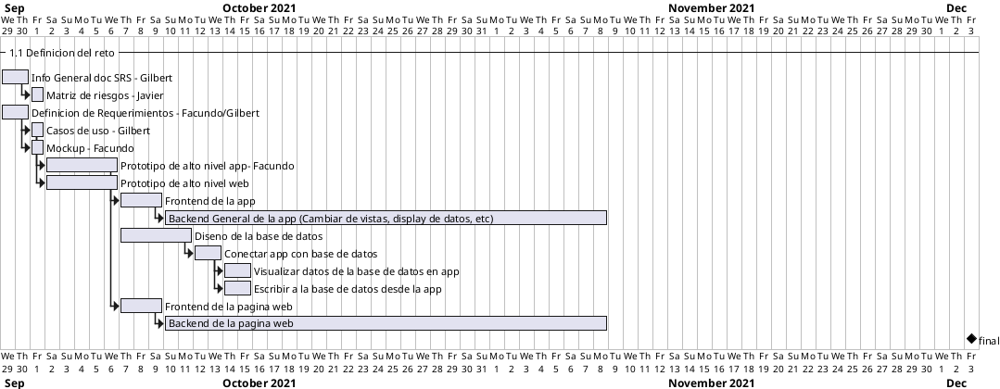

## Cronograma/Gantt

```plantuml

@startgantt
Project starts 2021-09-29

-- 1.1 Definicion del reto --
[Info General doc SRS - Gilbert] as [SRS] lasts 2 days and starts 2021-09-29
[Matriz de riesgos - Javier] as [MR] lasts 1 days and starts at [SRS]'s end

[Definicion de Requerimientos - Facundo/Gilbert] as [DR] lasts 2 day and starts 2021-09-29
[Casos de uso - Gilbert] as [CS] lasts 1 day and starts at [DR]'s end
[Mockup - Facundo] as [MP] lasts 1 days and starts at [CS]'s start

[Prototipo de alto nivel app- Facundo] as [PAN] lasts 5 days and starts at [CS]'s end
[Prototipo de alto nivel web] as [PAW] lasts 5 days and starts at [CS]'s end

[Frontend de la app] as [FEA] lasts 3 days and starts at [PAN]'s end
[Backend General de la app (Cambiar de vistas, display de datos, etc)] as [BGA] lasts 30 days and starts at [FEA]'s end

[Diseno de la base de datos] as [DBD] lasts 5 days and starts 2021-10-7
[Conectar app con base de datos] as [CBD] lasts 2 days and starts at [DBD]'s end
[Visualizar datos de la base de datos en app] as [VBD] lasts 2 days and starts at [CBD]'s end
[Escribir a la base de datos desde la app] as [EBD] lasts 2 days and starts at [CBD]'s end

[Frontend de la pagina web] as [FPW] lasts 3 days and starts at [PAW]'s end
[Backend de la pagina web] as [BPW] lasts 30 days and starts at [FPW]'s end

[final] happens 2021-12-3

@endgantt


```

