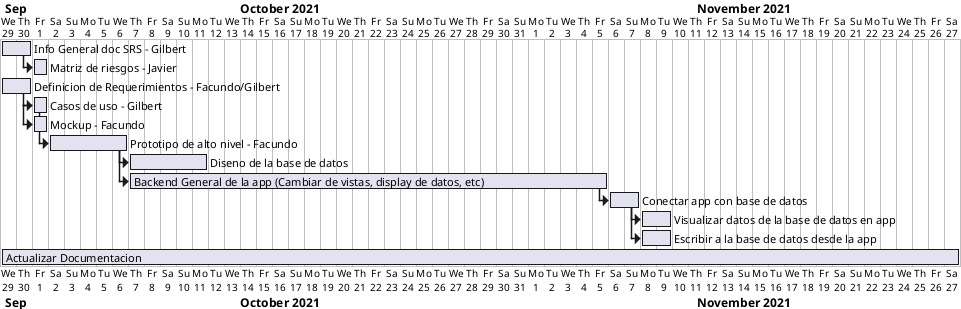

```plantuml

@startgantt
Project starts 2021-09-29

[Info General doc SRS - Gilbert] as [SRS] lasts 2 days and starts 2021-09-29
[Matriz de riesgos - Javier] as [MR] lasts 1 days and starts at [SRS]'s end

[Definicion de Requerimientos - Facundo/Gilbert] as [DR] lasts 2 day and starts 2021-09-29
[Casos de uso - Gilbert] as [CS] lasts 1 day and starts at [DR]'s end
[Mockup - Facundo] as [MP] lasts 1 days and starts at [CS]'s start

[Prototipo de alto nivel - Facundo] as [PAN] lasts 5 days and starts at [CS]'s end
[Diseno de la base de datos] as [DBD] lasts 5 days and starts at [PAN]'s end
[Backend General de la app (Cambiar de vistas, display de datos, etc)] as [BGA] lasts 30 days and starts at [PAN]'s end

[Conectar app con base de datos] as [CBD] lasts 2 days and starts at [BGA]'s end
[Visualizar datos de la base de datos en app] as [VBD] lasts 2 days and starts at [CBD]'s end
[Escribir a la base de datos desde la app] as [EBD] lasts 2 days and starts at [CBD]'s end


[Actualizar Documentacion] as [ASRS] lasts 60 days
@endgantt


```