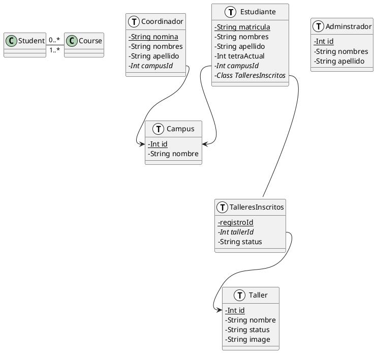

## Diagrama de clases

```plantuml
@startuml
skinparam classAttributeIconSize 0
class Estudiante <<(T,white)>> {
	{static} - String matricula
	-String nombres
	-String apellido
	-Int tetraActual
	{abstract} -Int campusId
	{abstract} -Class TalleresInscritos
}

class Campus <<(T,white)>> {
	{static} -Int id
	-String nombre
}

class TalleresInscritos <<(T,white)>> {
	{static} -registroId 
	{abstract} -Int tallerId
	-String status
}

class Coordinador <<(T,white)>> {
	{static} -String nomina
	-String nombres
	-String apellido
	{abstract} -Int campusId
}

class Taller <<(T,white)>> {
    {static} -Int id 
    - String nombre
    - String status
    - String image
}


class Adminstrador <<(T,white)>> {
	{static} -Int id
	-String nombres
	-String apellido
}


Student "0..*" - "1..*" Course

Estudiante::TalleresInscritos --- TalleresInscritos
TalleresInscritos::tallerId --> Taller::id
Estudiante::campusId --> Campus::id
Coordinador::campusId --> Campus::id 

@enduml
```