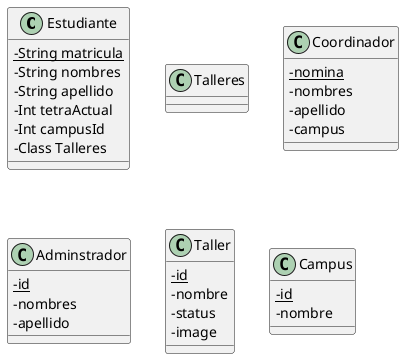

## Diagrama de clases

```plantuml
@startuml
skinparam classAttributeIconSize 0
class Estudiante {
	{static} - String matricula
	-String nombres
	-String apellido
	-Int tetraActual
	-Int campusId
	-Class Talleres
}

class Talleres {
	
}

class Coordinador {
	{static} -nomina
	-nombres
	-apellido
	-campus
}

class Adminstrador {
	{static} -id
	-nombres
	-apellido
}

class Taller {
    {static} - id 
    - nombre
    - status
    - image
}

class Campus {
	{static} -id
	-nombre
}

@enduml
```