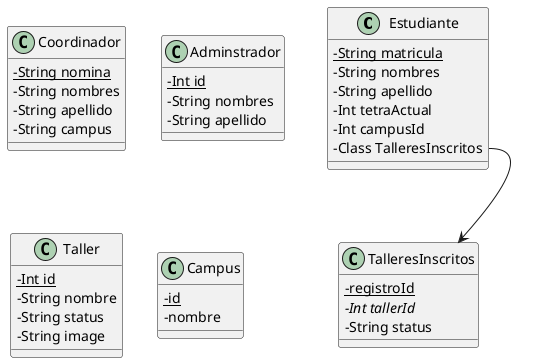

## Diagrama de clases

```plantuml
@startuml
skinparam classAttributeIconSize 0
class Estudiante {
	{static} - String matricula
	-String nombres
	-String apellido
	-Int tetraActual
	-Int campusId
	-Class TalleresInscritos
}

class TalleresInscritos {
	{static} -registroId 
	{abstract} -Int tallerId
	-String status
}

class Coordinador {
	{static} -String nomina
	-String nombres
	-String apellido
	-String campus
}

class Adminstrador {
	{static} -Int id
	-String nombres
	-String apellido
}

class Taller {
    {static} -Int id 
    - String nombre
    - String status
    - String image
}

class Campus {
	{static} -id
	-nombre
}

Estudiante::TalleresInscritos --> TalleresInscritos

@enduml
```