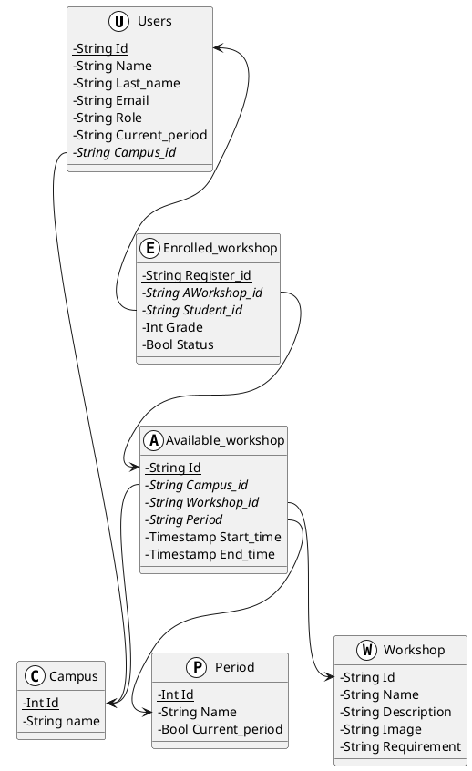

## Diagrama de clases

```plantuml
@startuml
skinparam classAttributeIconSize 0

class Users <<(U,white)>> {
	-{static} String Id
	-String Name
	-String Last_name
	-String Email
	-String Role
	-String Current_period
	{abstract} -String Campus_id
}

class Campus <<(C,white)>> {
	{static} -Int Id
	-String name
}

class Period <<(P,white)>> {
	{static} -Int Id
	-String Name
	-Bool Current_period
}

class Workshop <<(W,white)>> {
	{static} -String Id
	-String Name
	-String Description
	-String Image
	-String Requirement
}
class Available_workshop <<(A, white)>> {
	{static} -String Id
	{abstract} -String Campus_id
	{abstract} -String Workshop_id
	{abstract} -String Period
	-Timestamp Start_time
	-Timestamp End_time
}
class Enrolled_workshop <<(E,white)>> {
	{static} -String Register_id
	{abstract} -String AWorkshop_id
	{abstract} -String Student_id
	-Int Grade
	-Bool Status
}


Available_workshop::Campus_id --> Campus::Id
Available_workshop::Workshop_id --> Workshop::Id 
Available_workshop::Period --> Period::Name

Enrolled_workshop::AWorkshop_id --> Available_workshop::Id


Users::Id <-- Enrolled_workshop::Student_id

Campus::Id <-- Users::Campus_id


@enduml
```