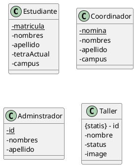

## Diagrama de clases

```plantuml
@startuml
skinparam classAttributeIconSize 0
class Estudiante {
	{static} -matricula
	-nombres
	-apellido
	-tetraActual
	-campus
}

class Coordinador {
	{static} -nomina
	-nombres
	-apellido
	-campus
}

class Adminstrador {
	{static} -id
	-nombres
	-apellido
}

class Taller {
    {statis} - id 
    - nombre
    - status
    - image
}

@enduml
```