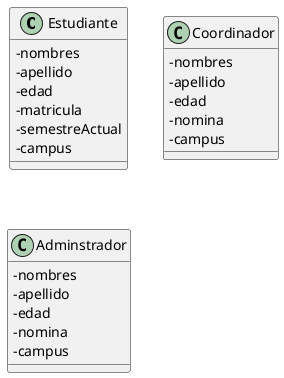

## Diagrama de clases

```plantuml
@startuml
skinparam classAttributeIconSize 0
class Estudiante {
	-nombres
	-apellido
	-edad
	-matricula
	-semestreActual
	-campus
}

class Coordinador {
	-nombres
	-apellido
	-edad
	-nomina
	-campus
}

class Adminstrador {
	-nombres
	-apellido
	-edad
	-nomina
	-campus
}

@enduml
```