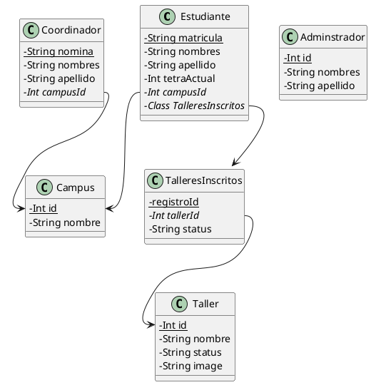

## Diagrama de clases

```plantuml
@startuml
skinparam classAttributeIconSize 0
class Estudiante {
	{static} - String matricula
	-String nombres
	-String apellido
	-Int tetraActual
	{abstract} -Int campusId
	{abstract} -Class TalleresInscritos
}

class Campus {
	{static} -Int id
	-String nombre
}

class TalleresInscritos {
	{static} -registroId 
	{abstract} -Int tallerId
	-String status
}

class Coordinador {
	{static} -String nomina
	-String nombres
	-String apellido
	{abstract} -Int campusId
}

class Taller {
    {static} -Int id 
    - String nombre
    - String status
    - String image
}


class Adminstrador {
	{static} -Int id
	-String nombres
	-String apellido
}

Estudiante::TalleresInscritos --> TalleresInscritos
TalleresInscritos::tallerId --> Taller::id
Estudiante::campusId --> Campus::id
Coordinador::campusId --> Campus::id 

@enduml
```