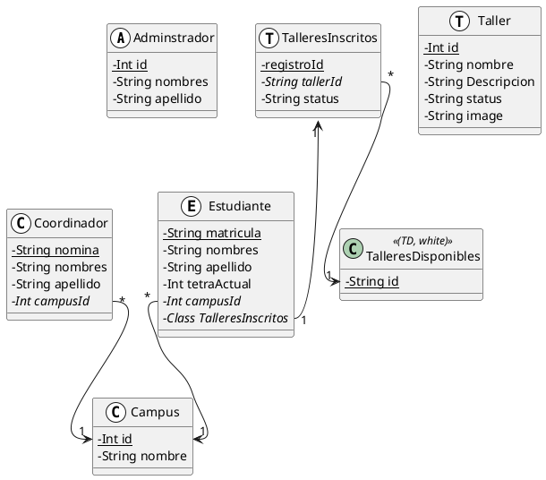

## Diagrama de clases

```plantuml
@startuml
skinparam classAttributeIconSize 0

class Adminstrador <<(A,white)>> {
	{static} -Int id
	-String nombres
	-String apellido
}

class Estudiante <<(E,white)>> {
	{static} - String matricula
	-String nombres
	-String apellido
	-Int tetraActual
	{abstract} -Int campusId
	{abstract} -Class TalleresInscritos
}

class Campus <<(C,white)>> {
	{static} -Int id
	-String nombre
}

class TalleresInscritos <<(T,white)>> {
	{static} -registroId 
	{abstract} -String tallerId
	-String status
}

class Coordinador <<(C,white)>> {
	{static} -String nomina
	-String nombres
	-String apellido
	{abstract} -Int campusId
}

class Taller <<(T,white)>> {
    {static} -Int id 
    - String nombre
	- String Descripcion
    - String status
    - String image
}

class TalleresDisponibles <<(TD, white)>> {
	{static} -String id
}


TalleresInscritos "1" <-- "1" Estudiante::TalleresInscritos
TalleresInscritos::tallerId "*" --> "1" TalleresDisponibles::id
Estudiante::campusId "*" --> "1" Campus::id
Coordinador::campusId "*" --> "1" Campus::id 

@enduml
```