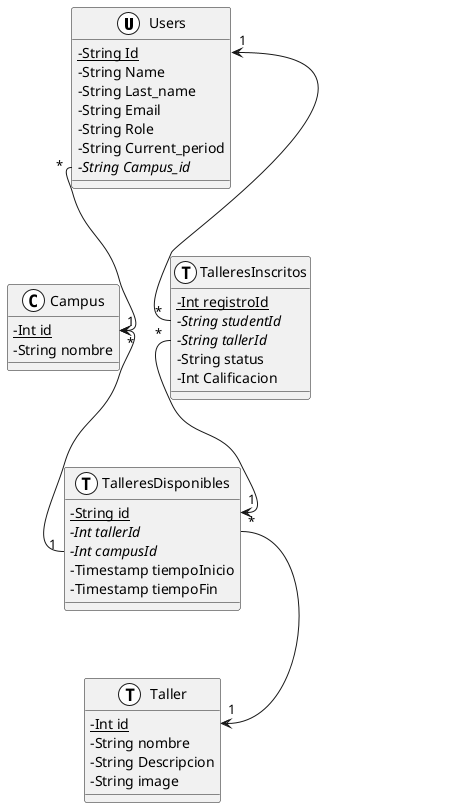

## Diagrama de clases

```plantuml
@startuml
skinparam classAttributeIconSize 0

class Users <<(U,white)>> {
	-{static} String Id
	-String Name
	-String Last_name
	-String Email
	-String Role
	-String Current_period
	{abstract} -String Campus_id
}

class Campus <<(C,white)>> {
	{static} -Int id
	-String nombre
}

class Taller <<(T,white)>> {
    {static} -Int id 
    - String nombre
	- String Descripcion
    - String image
}
class TalleresDisponibles <<(T, white)>> {
	{static} -String id
	{abstract} -Int tallerId
	{abstract} -Int campusId
	-Timestamp tiempoInicio
	-Timestamp tiempoFin
}
class TalleresInscritos <<(T,white)>> {
	{static} -Int registroId 
	{abstract} -String studentId
	{abstract} -String tallerId
	-String status
	-Int Calificacion
}

Users::Id "1" <-- "*" TalleresInscritos::studentId
Users::Campus_id "*" --> "1" Campus::id
TalleresInscritos::tallerId "*" --> "1" TalleresDisponibles::id
TalleresDisponibles::tallerId "*" --> "1" Taller::id
Campus::id "*" <-- "1" TalleresDisponibles::campusId


@enduml
```